# BAB 3 - Perancangan Sistem Pakar Diagnosis Gangguan Layanan IndiHome

Dokumen ini merangkum rancangan sistem dari website yang telah dibangun pada repository ini.

## 1. Arsitektur Sistem Pakar Diagnosis Gangguan Layanan IndiHome

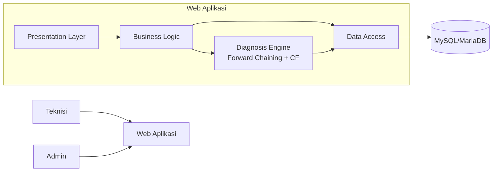
```mermaid
flowchart LR
    U[Teknisi] --> W[Web Aplikasi]
    A[Admin] --> W

    subgraph Web Aplikasi
        UI[Presentation Layer]
        BL[Business Logic]
        DS[Diagnosis Engine<br/>Forward Chaining + CF]
        DA[Data Access]
    end

    UI --> BL
    BL --> DS
    BL --> DA
    DS --> DA
    DA --> DB[(MySQL/MariaDB)]
```

## 2. Algoritma Diagnosis Gangguan Layanan IndiHome (Forward Chaining dan Certainty Factor)

Alur utama:
1. Teknisi memilih gejala dan tingkat keyakinan.
2. Sistem mengambil aturan dari `basis_pengetahuan`.
3. Mesin inferensi melakukan forward chaining (fakta gejala → kandidat gangguan).
4. Nilai CF dihitung per aturan: `CF = (MB - MD) x bobot_user`.
5. Nilai CF kandidat gangguan digabungkan.
6. Hasil diurutkan dan ditampilkan berdasarkan CF tertinggi.

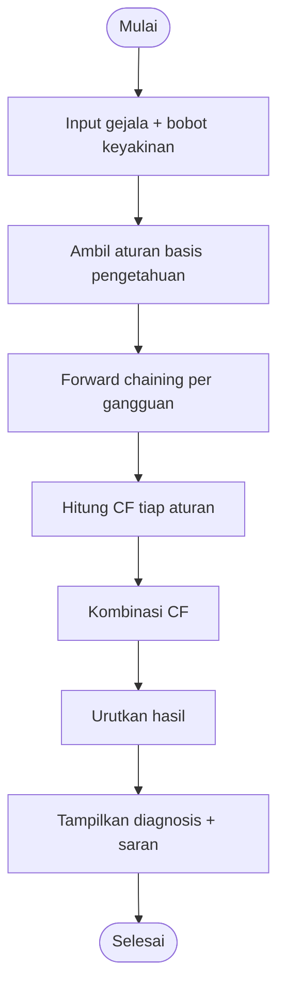
```mermaid
flowchart TD
    S([Mulai]) --> I[Input gejala + bobot keyakinan]
    I --> R[Ambil aturan basis pengetahuan]
    R --> F[Forward chaining per gangguan]
    F --> C[Hitung CF tiap aturan]
    C --> K[Kombinasi CF]
    K --> O[Urutkan hasil]
    O --> H[Tampilkan diagnosis + saran]
    H --> E([Selesai])
```

## 3. Struktur Program Sistem Pakar Diagnosis Gangguan Layanan IndiHome

Struktur modul utama pada project:

| Area | Path Utama | Fungsi |
|---|---|---|
| Beranda/Public | `index.php`, `modul/welcome.php`, `modul/tentang.php` | Halaman umum pengguna |
| Diagnosis | `modul/diagnosa/` | Input gejala, proses forward chaining + CF, hasil diagnosis |
| Admin/Auth | `login.php`, `logout.php`, `modul/formlogin.php`, `modul/password/` | Login admin, ubah password, logout |
| Master Data | `modul/admin/`, `modul/repair/`, `modul/incident/`, `modul/pengetahuan/` | Kelola admin, gangguan, gejala, basis pengetahuan |
| Artikel/Keterangan | `modul/post/`, `modul/keterangan.php`, `modul/form_content.php` | Kelola artikel/keterangan layanan |
| Konfigurasi | `config/` | Koneksi dan konfigurasi sistem |

## 4. Use Case Diagram Teknisi

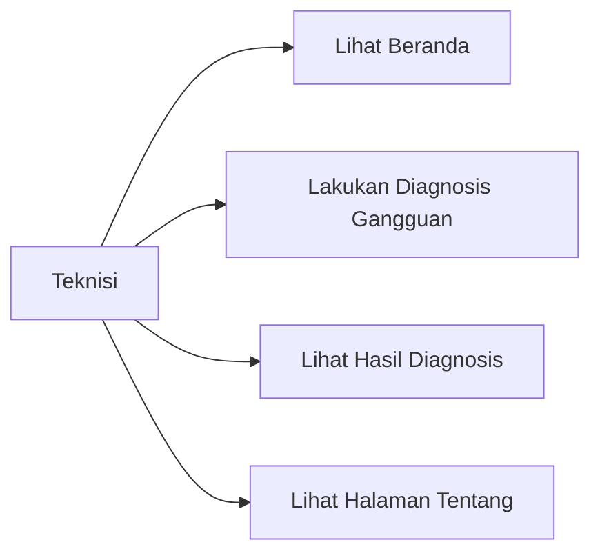
```mermaid
flowchart LR
    T[Teknisi] --> UC1[Lihat Beranda]
    T --> UC2[Lakukan Diagnosis Gangguan]
    T --> UC3[Lihat Hasil Diagnosis]
    T --> UC4[Lihat Halaman Tentang]
```

## 5. Use Case Diagram Admin

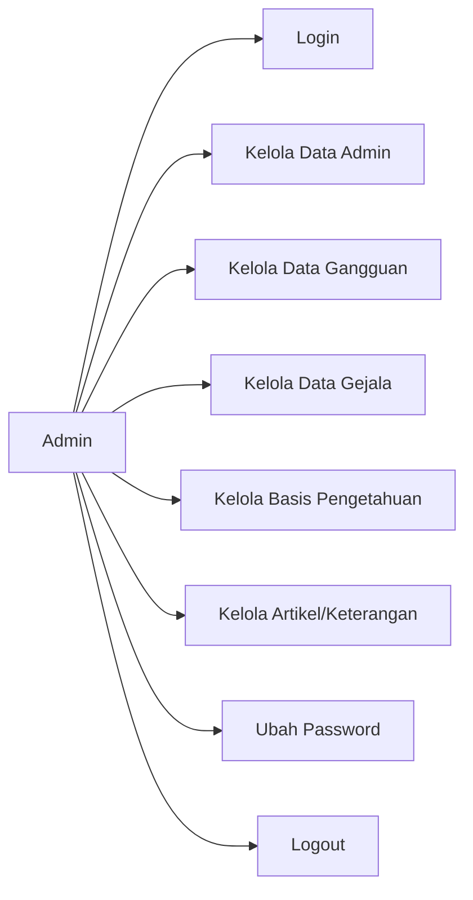
```mermaid
flowchart LR
    AD[Admin] --> A1[Login]
    AD --> A2[Kelola Data Admin]
    AD --> A3[Kelola Data Gangguan]
    AD --> A4[Kelola Data Gejala]
    AD --> A5[Kelola Basis Pengetahuan]
    AD --> A6[Kelola Artikel/Keterangan]
    AD --> A7[Ubah Password]
    AD --> A8[Logout]
```

## 6. Activity Diagram Beranda

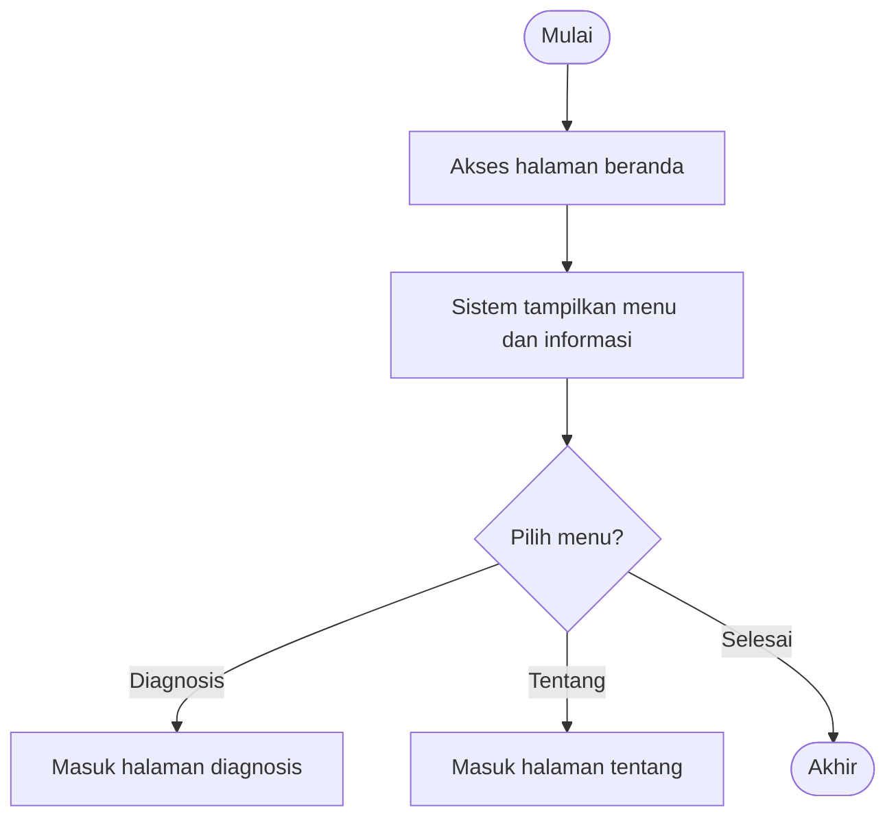
```mermaid
flowchart TD
    A([Mulai]) --> B[Akses halaman beranda]
    B --> C[Sistem tampilkan menu dan informasi]
    C --> D{Pilih menu?}
    D -->|Diagnosis| E[Masuk halaman diagnosis]
    D -->|Tentang| F[Masuk halaman tentang]
    D -->|Selesai| G([Akhir])
```

## 7. Activity Diagram Diagnosis Gangguan

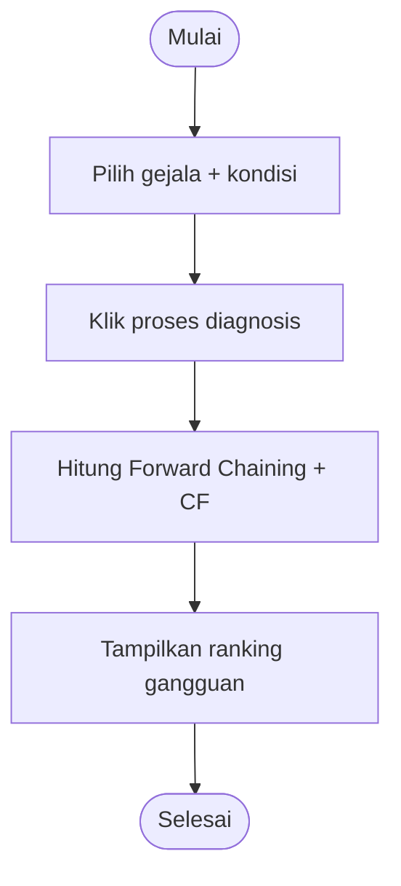
```mermaid
flowchart TD
    A([Mulai]) --> B[Pilih gejala + kondisi]
    B --> C[Klik proses diagnosis]
    C --> D[Hitung Forward Chaining + CF]
    D --> E[Tampilkan ranking gangguan]
    E --> F([Selesai])
```

## 8. Activity Diagram Kelola Artikel/Keterangan

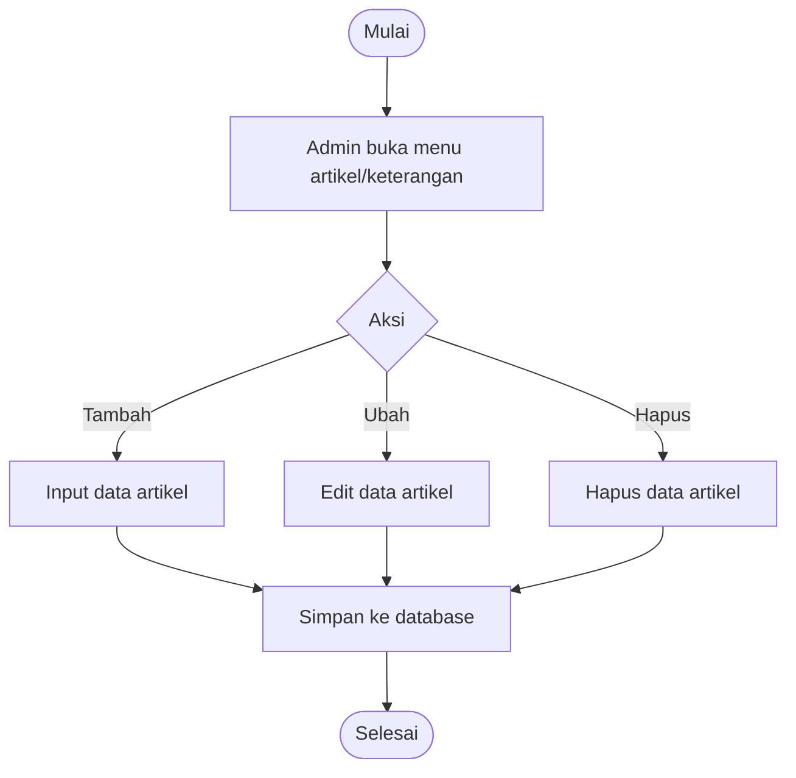
```mermaid
flowchart TD
    A([Mulai]) --> B[Admin buka menu artikel/keterangan]
    B --> C{Aksi}
    C -->|Tambah| D[Input data artikel]
    C -->|Ubah| E[Edit data artikel]
    C -->|Hapus| F[Hapus data artikel]
    D --> G[Simpan ke database]
    E --> G
    F --> G
    G --> H([Selesai])
```

## 9. Activity Diagram Tentang

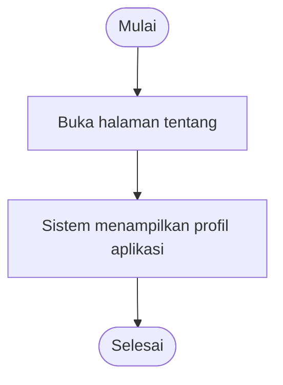
```mermaid
flowchart TD
    A([Mulai]) --> B[Buka halaman tentang]
    B --> C[Sistem menampilkan profil aplikasi]
    C --> D([Selesai])
```

## 10. Activity Diagram Login Admin

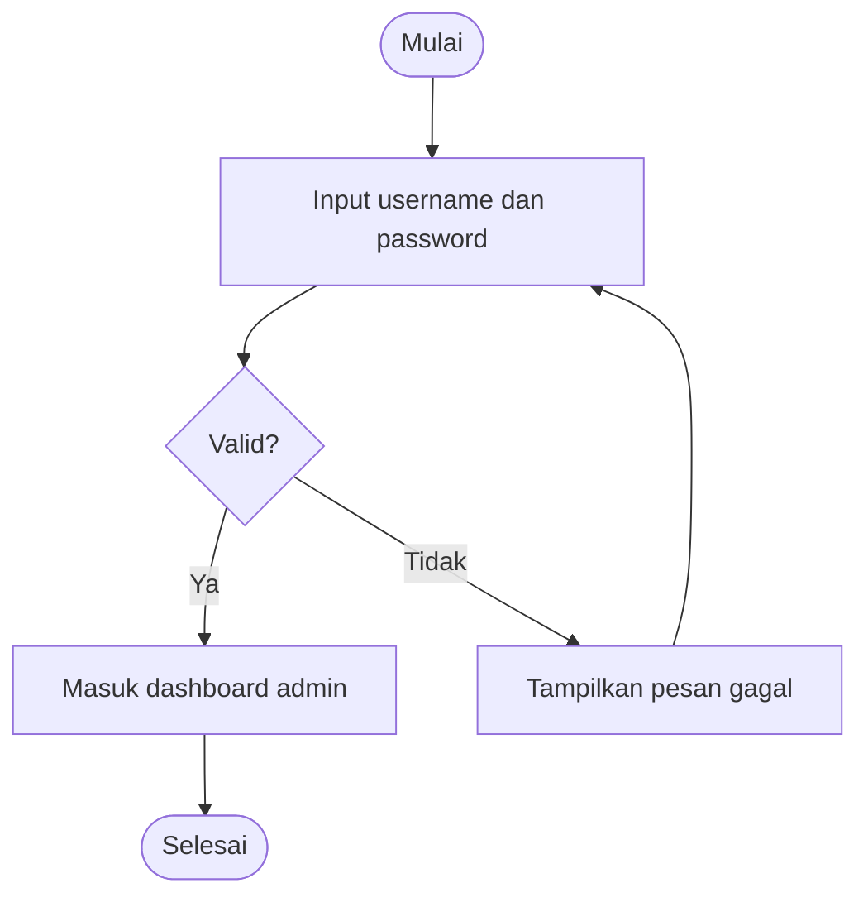
```mermaid
flowchart TD
    A([Mulai]) --> B[Input username dan password]
    B --> C{Valid?}
    C -->|Ya| D[Masuk dashboard admin]
    C -->|Tidak| E[Tampilkan pesan gagal]
    E --> B
    D --> F([Selesai])
```

## 11. Activity Diagram Kelola Data Admin

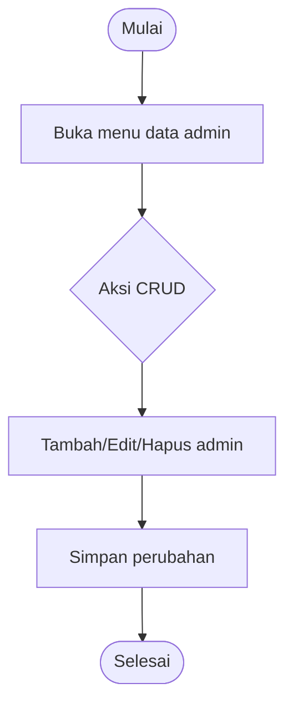
```mermaid
flowchart TD
    A([Mulai]) --> B[Buka menu data admin]
    B --> C{Aksi CRUD}
    C --> D[Tambah/Edit/Hapus admin]
    D --> E[Simpan perubahan]
    E --> F([Selesai])
```

## 12. Activity Diagram Kelola Data Gangguan

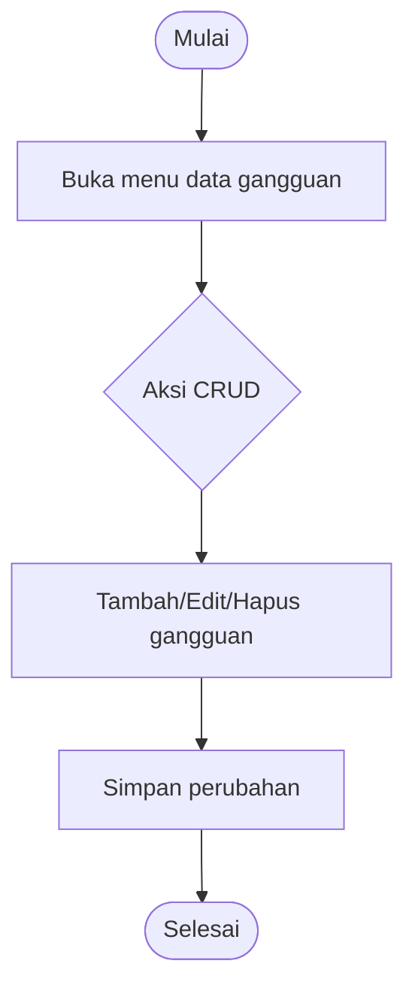
```mermaid
flowchart TD
    A([Mulai]) --> B[Buka menu data gangguan]
    B --> C{Aksi CRUD}
    C --> D[Tambah/Edit/Hapus gangguan]
    D --> E[Simpan perubahan]
    E --> F([Selesai])
```

## 13. Activity Diagram Kelola Data Gejala

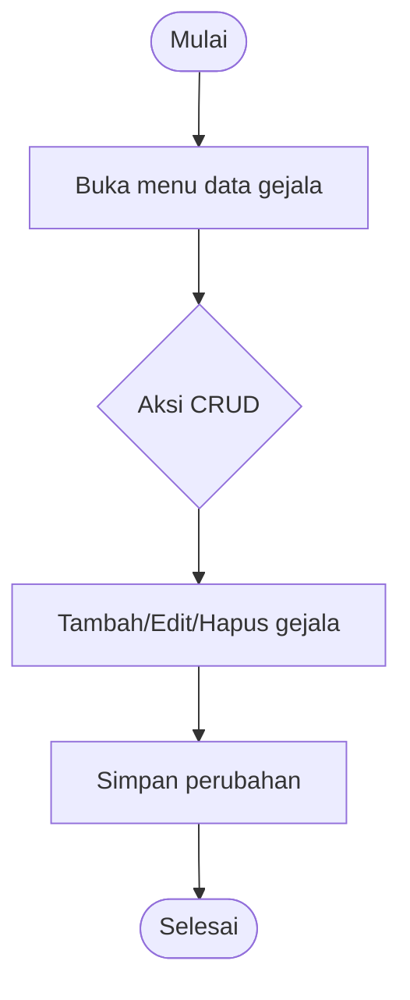
```mermaid
flowchart TD
    A([Mulai]) --> B[Buka menu data gejala]
    B --> C{Aksi CRUD}
    C --> D[Tambah/Edit/Hapus gejala]
    D --> E[Simpan perubahan]
    E --> F([Selesai])
```

## 14. Activity Diagram Kelola Basis Pengetahuan

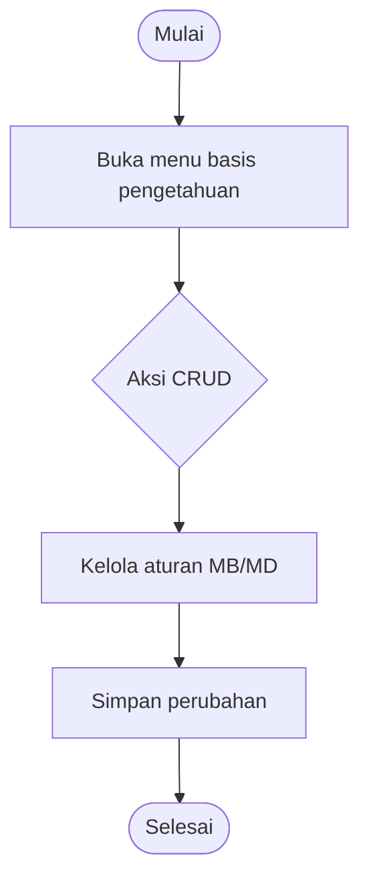
```mermaid
flowchart TD
    A([Mulai]) --> B[Buka menu basis pengetahuan]
    B --> C{Aksi CRUD}
    C --> D[Kelola aturan MB/MD]
    D --> E[Simpan perubahan]
    E --> F([Selesai])
```

## 15. Activity Diagram Ubah Password

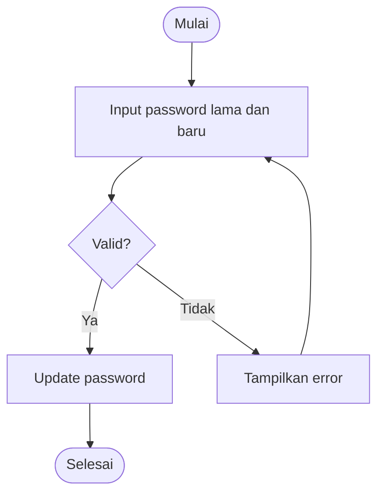
```mermaid
flowchart TD
    A([Mulai]) --> B[Input password lama dan baru]
    B --> C{Valid?}
    C -->|Ya| D[Update password]
    C -->|Tidak| E[Tampilkan error]
    D --> F([Selesai])
    E --> B
```

## 16. Activity Diagram Logout

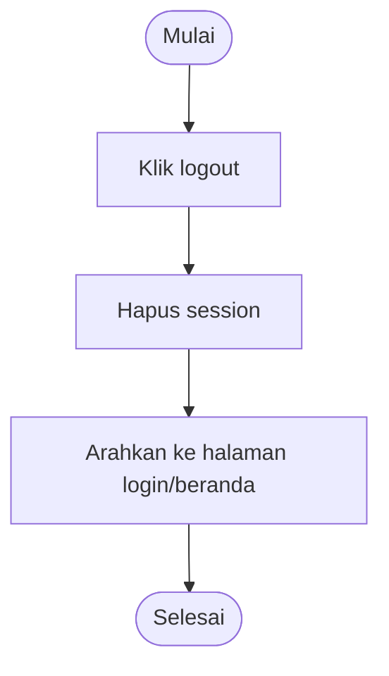
```mermaid
flowchart TD
    A([Mulai]) --> B[Klik logout]
    B --> C[Hapus session]
    C --> D[Arahkan ke halaman login/beranda]
    D --> E([Selesai])
```

## 17. Class Diagram Sistem Pakar Diagnosis Gangguan Layanan IndiHome

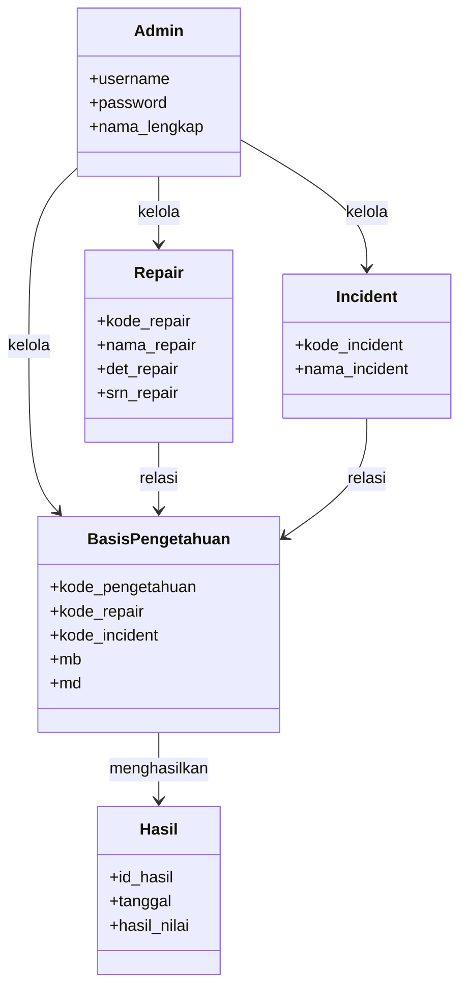
```mermaid
classDiagram
    class Admin {
        +username
        +password
        +nama_lengkap
    }

    class Repair {
        +kode_repair
        +nama_repair
        +det_repair
        +srn_repair
    }

    class Incident {
        +kode_incident
        +nama_incident
    }

    class BasisPengetahuan {
        +kode_pengetahuan
        +kode_repair
        +kode_incident
        +mb
        +md
    }

    class Hasil {
        +id_hasil
        +tanggal
        +hasil_nilai
    }

    Admin --> Repair : kelola
    Admin --> Incident : kelola
    Admin --> BasisPengetahuan : kelola
    Repair --> BasisPengetahuan : relasi
    Incident --> BasisPengetahuan : relasi
    BasisPengetahuan --> Hasil : menghasilkan
```

## 18. Sequence Diagram Beranda

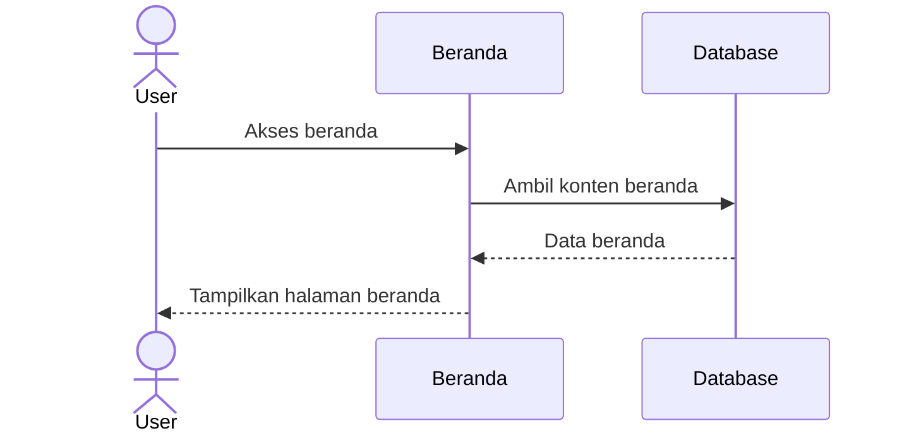
```mermaid
sequenceDiagram
    actor User
    participant UI as Beranda
    participant DB as Database
    User->>UI: Akses beranda
    UI->>DB: Ambil konten beranda
    DB-->>UI: Data beranda
    UI-->>User: Tampilkan halaman beranda
```

## 19. Sequence Diagram Diagnosis Gangguan

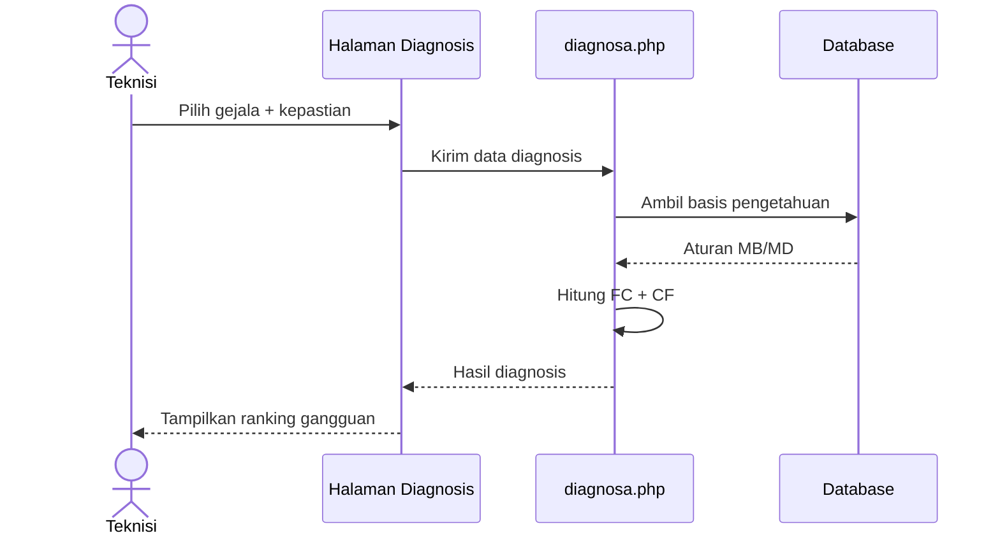
```mermaid
sequenceDiagram
    actor Teknisi
    participant UI as Halaman Diagnosis
    participant C as diagnosa.php
    participant DB as Database
    Teknisi->>UI: Pilih gejala + kepastian
    UI->>C: Kirim data diagnosis
    C->>DB: Ambil basis pengetahuan
    DB-->>C: Aturan MB/MD
    C->>C: Hitung FC + CF
    C-->>UI: Hasil diagnosis
    UI-->>Teknisi: Tampilkan ranking gangguan
```

## 20. Sequence Diagram Kelola Artikel/Keterangan

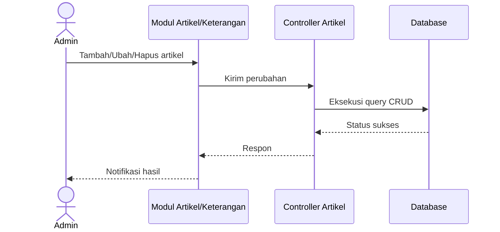
```mermaid
sequenceDiagram
    actor Admin
    participant UI as Modul Artikel/Keterangan
    participant C as Controller Artikel
    participant DB as Database
    Admin->>UI: Tambah/Ubah/Hapus artikel
    UI->>C: Kirim perubahan
    C->>DB: Eksekusi query CRUD
    DB-->>C: Status sukses
    C-->>UI: Respon
    UI-->>Admin: Notifikasi hasil
```

## 21. Sequence Diagram Tentang

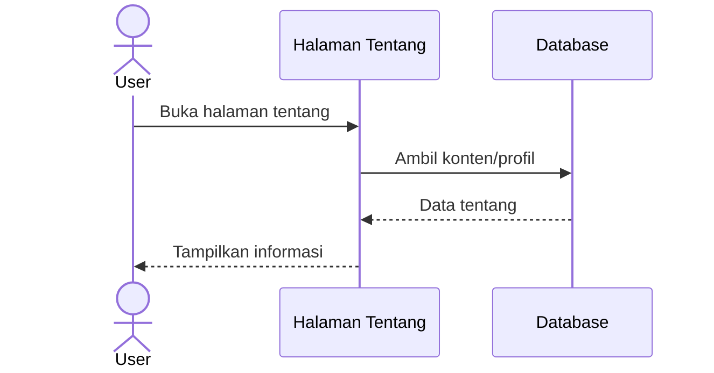
```mermaid
sequenceDiagram
    actor User
    participant UI as Halaman Tentang
    participant DB as Database
    User->>UI: Buka halaman tentang
    UI->>DB: Ambil konten/profil
    DB-->>UI: Data tentang
    UI-->>User: Tampilkan informasi
```

## 22. Sequence Diagram Login Admin

```mermaid
sequenceDiagram
    actor Admin
    participant UI as Form Login
    participant C as login.php
    participant DB as Database
    Admin->>UI: Input kredensial
    UI->>C: Submit login
    C->>DB: Verifikasi akun admin
    DB-->>C: Hasil validasi
    C-->>UI: Status login
    UI-->>Admin: Masuk dashboard / pesan gagal
```

## 23. Sequence Diagram Kelola Data Admin

```mermaid
sequenceDiagram
    actor Admin
    participant UI as Modul Data Admin
    participant C as Controller Admin
    participant DB as Database
    Admin->>UI: Aksi CRUD data admin
    UI->>C: Kirim permintaan
    C->>DB: Proses query CRUD
    DB-->>C: Hasil
    C-->>UI: Respon
    UI-->>Admin: Tampilkan hasil
```

## 24. Sequence Diagram Kelola Data Gangguan

```mermaid
sequenceDiagram
    actor Admin
    participant UI as Modul Data Gangguan
    participant C as Controller Gangguan
    participant DB as Database
    Admin->>UI: Aksi CRUD gangguan
    UI->>C: Kirim data
    C->>DB: Simpan/ubah/hapus data gangguan
    DB-->>C: Status
    C-->>UI: Respon
    UI-->>Admin: Notifikasi hasil
```

## 25. Sequence Diagram Kelola Data Gejala

```mermaid
sequenceDiagram
    actor Admin
    participant UI as Modul Data Gejala
    participant C as Controller Gejala
    participant DB as Database
    Admin->>UI: Aksi CRUD gejala
    UI->>C: Kirim data gejala
    C->>DB: Query CRUD gejala
    DB-->>C: Status
    C-->>UI: Respon
    UI-->>Admin: Tampilkan status
```

## 26. Sequence Diagram Kelola Basis Pengetahuan

```mermaid
sequenceDiagram
    actor Admin
    participant UI as Modul Basis Pengetahuan
    participant C as Controller Pengetahuan
    participant DB as Database
    Admin->>UI: Kelola aturan MB/MD
    UI->>C: Submit data aturan
    C->>DB: Query CRUD basis_pengetahuan
    DB-->>C: Status perubahan
    C-->>UI: Respon
    UI-->>Admin: Notifikasi
```

## 27. Sequence Diagram Ubah Password

```mermaid
sequenceDiagram
    actor Admin
    participant UI as Form Ubah Password
    participant C as Controller Password
    participant DB as Database
    Admin->>UI: Input password lama & baru
    UI->>C: Submit perubahan
    C->>DB: Validasi + update password
    DB-->>C: Hasil update
    C-->>UI: Status
    UI-->>Admin: Pesan sukses/gagal
```

## 28. Sequence Diagram Logout

```mermaid
sequenceDiagram
    actor Admin
    participant UI as Halaman Admin
    participant C as logout.php
    Admin->>UI: Klik logout
    UI->>C: Request logout
    C->>C: Destroy session
    C-->>UI: Redirect login/beranda
    UI-->>Admin: Sesi berakhir
```

## 29. Rancangan Relasi Antar Tabel

Rancangan basis data inti sistem:
- `admin` untuk otentikasi dan pengelolaan.
- `repair` untuk data gangguan.
- `incident` untuk data gejala.
- `basis_pengetahuan` untuk aturan diagnosis (MB/MD).
- `hasil` untuk histori hasil diagnosis.
- `post` untuk artikel/keterangan.
- `kondisi` untuk bobot tingkat keyakinan gejala.

## 30. Entity Relationship Diagram (ERD)

```mermaid
erDiagram
    ADMIN ||--o{ HASIL : mengelola
    REPAIR ||--o{ BASIS_PENGETAHUAN : memiliki
    INCIDENT ||--o{ BASIS_PENGETAHUAN : memiliki
    BASIS_PENGETAHUAN ||--o{ HASIL : menghasilkan
    REPAIR ||--o{ POST : dijelaskan

    ADMIN {
        varchar username PK
        varchar password
        varchar nama_lengkap
    }
    REPAIR {
        int kode_repair PK
        varchar nama_repair
    }
    INCIDENT {
        int kode_incident PK
        varchar nama_incident
    }
    BASIS_PENGETAHUAN {
        int kode_pengetahuan PK
        int kode_repair FK
        int kode_incident FK
        double mb
        double md
    }
    HASIL {
        int id_hasil PK
        varchar tanggal
        int hasil_id
        varchar hasil_nilai
    }
```

## 31. Relasi Antartabel

1. `repair` 1..* `basis_pengetahuan` melalui `kode_repair`.
2. `incident` 1..* `basis_pengetahuan` melalui `kode_incident`.
3. `basis_pengetahuan` menjadi sumber aturan untuk proses diagnosis pada `hasil`.
4. `admin` berperan mengelola data master dan histori.
5. `post` digunakan untuk dukungan informasi/keterangan gangguan.

---

Dokumen ini dapat langsung digunakan sebagai materi BAB 3 (Perancangan Sistem) dan disesuaikan dengan format kampus/dosen pembimbing.
